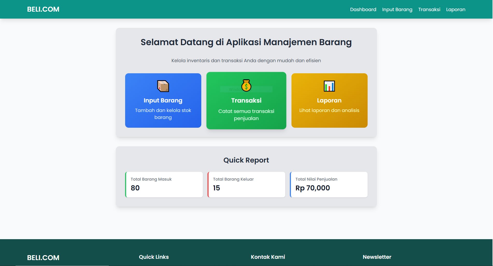
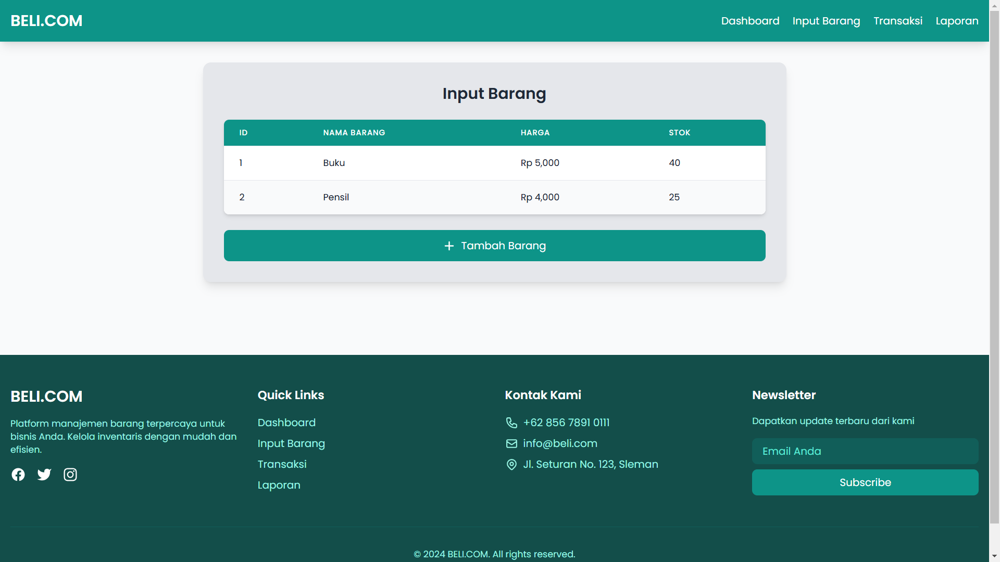
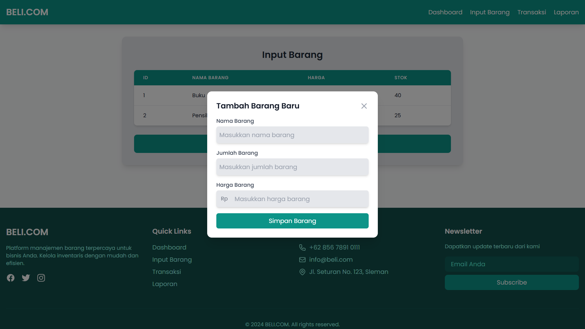

# 📦 Manajemen Barang

> Sistem manajemen barang berbasis web untuk mengelola inventaris dengan mudah dan efisien.

## 📋 Deskripsi Proyek

BELI.COM adalah aplikasi berbasis web yang dirancang untuk membantu pengelolaan dan pemantauan inventaris barang. Sistem ini menyediakan fitur-fitur untuk pencatatan, pelacakan, dan pelaporan stok barang secara real-time.

## ⭐ Fitur Utama

- 📝 Pencatatan barang masuk dan keluar
- 📊 Monitoring stok barang secara real-time
- 📈 Laporan inventaris dalam berbagai format
- 📱 Antarmuka responsif untuk desktop dan mobile

## 🛠️ Teknologi yang Digunakan

- Python
- HTML/CSS
- TailwindCSS
- JavaScript

## 💻 Cara Instalasi

1. Clone repository ini
```bash
git clone https://github.com/muzaaqi/manajemen-barang-pwm.git
```

2. Import database
```bash
# Import file SQL yang tersedia di folder db
```
4. Jalankan file main.py

## 📱 Screenshot Aplikasi

1. Dashboard

2. Input Barang

3. Form Input Barang

4. Transaksi

5. Laporan


## 📖 Panduan Penggunaan

### User
1. Input Barang(Nama barang, harga barang, jumlah barang)
2. Mencatat Transaksi(ID barang, jumlah barang)
3. Melihat laporan keseluruhan

## 👨‍💻 Pengembang

- [Muzaaqi](https://github.com/muzaaqi)

## 📞 Kontak

Jika Anda memiliki pertanyaan atau menemukan masalah, silakan hubungi:
- Email: muzaaqi@yahoo.com
- GitHub: [@muzaaqi](https://github.com/muzaaqi)

## 📄 Lisensi

Proyek ini dilisensikan di bawah [MIT License](LICENSE)

---
⭐ Developed with ❤️ by Muzaaqi
